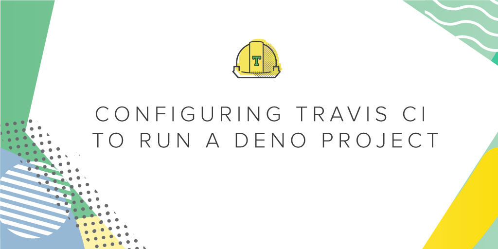
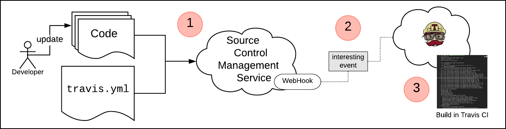

Nothing lasts forever in the world of ephemeral computing. It’s the nature of the beast. Today, more companies are maximizing their IT budgets by practicing the principles of infrastructure as code (IaC). They’re creating and destroying virtual assets on demand in order to meet the needs of the moment. 

<!-- more --> 

# Getting started 

I am a big fan of Deno. I am also a big fan of Travis CI. What’s not to like? Deno is a powerful new programming framework that picks up where Node.js left off. Travis CI is a CI/CD platform that integrates easily with the projects stored in my GitHub repo. They’re both very cool.

But there’s a problem: Travis CI does not support Deno out of the box.

[Deno](https://deno.land) is still in its infancy, so it makes sense that it is not quite yet on the Travis CI radar. Still, no biggie. Travis CI is flexible enough to allow me to build support for Deno right into the CI/CD workflow that kicks off when my Deno project runs on Travis CI. In fact, getting Deno to run on Travis CI was pretty easy, and the results are very useful, so allow me to share.

First I’m going to cover the overall process for deploying to Travis CI and running a workflow defined in a `.travis.yml` file. Then I’ll show you the custom `.travis.yml` file I wrote that has Travis CI install Deno and run the unit tests for my Deno project.

## Travis CI 101
Travis CI runs a CI/CD process right out of the box as part of its signup process. The first time you come to travic-ci.org, you’ll be asked to log in to Travis CI using your GitHub or BitBucket credentials. (The Bitbucket signup is in beta.)

The signup process asks you to declare repositories on the source code management (SCM) service, into which a webhook will be installed. Once a webhook is installed on the given repository, Travis CI will receive notifications about events that happen in that repository. For example, when a developer commits code into a repository that has a webhook installed, Travis CI will be notified about the commit.

Travis CI will clone the contents of that repo into a virtual machine instance running in the Travis CI domain. Once the runner VM has the contents of the cloned repository, it will look for a special file named travis.yml that contains instructions for provisioning the VM and about tasks to perform once the runner VM is provisioned. Figure 1 below describes the process.


> Figure 1: The Travis CI Workflow

As you can see in callout 1 above, the first step in the workflow process is that a developer commits updated code to the repository of interest in the SCM service running in the cloud. A webhook in the repository “sees” the commit and emits an event message that is captured by Travis CI, as shown at callout 2. Travis CI clones the repository’s code into a VM in its domain and then looks for the `.travis.yml` file in the cloned files. The `.travis.yml` file is identified, and the configuration and instructions in `.travis.yml` are executed, as shown at callout 3.

The process is straightforward, and it’s quite powerful in that we can construct the `.travis.yml` file to define custom configuration and execute tasks that are special, too. In fact, we’re going to use `travis.yml` to install the Deno language on the runner VM and then execute the unit tests that are part of my Deno project. This is very cool because, remember, as of this writing Travis CI does not support Deno out of the box.

Let’s take a look at how support for Deno is implemented.

## Getting Travis CI to support Deno

As mentioned above, the way you get Travis CI to do what you want it to do in its CI/CD process is to construct a `.travis.yml` file according to the format defined in the Travis CI build config specification.

The way I got Travis CI to support Deno was to do a bit of a hack in my project’s `.travis.yml` file. The entire contents of `.travis.yml` are shown below in listing 1. Let’s take a look at the details on a line-by-line basis:

```yaml
language: default
os: ubuntu
services:
    - docker
branches:
    only:
    - master
before_install:
    - pwd
    - curl -fsSL https://deno.land/x/install/install.sh | sh
    - ls -l $HOME/.deno
    - export DENO_INSTALL="$HOME/.deno"
    - export PATH="$DENO_INSTALL/bin:$PATH"
    - deno run https://deno.land/std/examples/welcome.ts   
script: 
    - cd ./simplecalc/test/
    - sh run_test.sh
    - cd ../../fortune_cookies/test
    - sh run_test.sh
```
> Listing 1: .travis.yml 

Travis CI allows you to define a [language](https://config.travis-ci.com/ref/language) that gets implemented in the VM runner. It supports a [variety of languages](https://docs.travis-ci.com/user/languages/) out of the box, but sadly, Deno isn’t one of them. Thus, at Line 1 in the travis.yml file above, I set the value of the `language` attribute to `default`. It really doesn’t matter which `language` I define, because I am going to install Deno anyway.

At line 2 at the os attribute, I set the runner VM’s operating system to Ubuntu. Travis CI supports the macOS and Windows operating system too, but I use Ubuntu because my code is intended to run on Linux.

Travis CI allows you to configure the runner VM with a variety of services. For example, I could apply values to the services attribute that will install MySQL, Redis and Memcached to the runner VM automatically. In my case, I need to have Docker installed because one of my unit tests requires that a web server programmed under Deno be up and running as a Docker container. So at Lines 3 and 4, I set docker as a service.

At line 2 at the [os](https://config.travis-ci.com/ref/os) attribute, I set the runner VM’s operating system to Ubuntu. Travis CI supports the macOS and Windows operating system too, but I use Ubuntu because my code is intended to run on Linux.

Travis CI allows you to configure the runner VM with a variety of [services](https://config.travis-ci.com/ref/job/services). For example, I could apply values to the services attribute that will install [MySQL](https://www.mysql.com/), [Redis](https://redislabs.com/) and [Memcached](https://www.memcached.org/) to the runner VM automatically. In my case, I need to have [Docker](https://www.docker.com/) installed because one of my unit tests requires that a web server programmed under Deno be up and running as a Docker container. So at Lines 3 and 4, I set Docker as a service.

Lines 5 through 7 set the [branches](https://config.travis-ci.com/ref/job/branches) attribute to tell Travis CI to use the code in the master branch of the cloned repository. You can set Travis CI to process specific branches in a given repo, but in this case, the code I’m interested in unit testing is in the master branch.

Lines 8 through 14 are where Deno support is implemented. I add the command line tasks required to download Deno. Once downloaded, the task will install Deno and then check that Deno is running. This is all defined under the `before_install` attribute, which indicates the stage before installation in the [Travis CI job lifecycle](https://docs.travis-ci.com/user/job-lifecycle). The install stage is the time when all dependencies are installed, so in this case, I am telling Travis CI to install Deno before any other download and configuration happens.

Line 9 tells Travis CI to output the present working directory [(pwd)](https://en.wikipedia.org/wiki/Pwd). I do this to provide debugging information that might be useful later.

Line 10 runs the `curl` command that downloads and executes the shell (sh) script that does the actual work of installing Deno.

Line 11 lists the contents of the .deno directory. I do this to provide debugging information. When the Deno installation is run, it creates a .deno directory in the user’s `$HOME` directory where the Deno binaries and dependencies are stored.

Line 12 creates an environment variable, `DENO_INSTALL` which describes the location of the Deno binary and dependencies.

Line 14 runs the simple “Hello World” Deno application, which is downloaded directly from the Deno home site. I do this just to confirm that Deno is up and running properly.

Lines 15 through19 run the unit tests for the various subjects that are part of my main projects. (See figure 2, below.)


> Figure 2: An excerpt from the console output created with travis.yml running my project’s unit tests

That’s it. As you can see, I got Deno up and running under Travis CI using a trivial amount of code in the `.travis.yml` file. Being able to do so much with such a small amount of code attests to the power that Travis CI brings to the CI/CD experience.

You can view the code for this Deno project on GitHub [here](https://github.com/reselbob/denodemo).

## Join the initiative
Travis CI provides the power and flexibility to make just about any CI/CD workflow possible. The platform’s versatility is reason enough for enterprises to consider adopting it. But when it comes to running Deno under Travis CI, there’s more!

Travis CI supports implementing [community-based languages](https://docs.travis-ci.com/user/languages/community-supported-languages). Thus, it’s entirely possible to get Deno incorporated into the array of languages that Travis CI supports once the [infrastructure](https://docs.travis-ci.com/user/languages/community-supported-languages#adding-a-new-language) is in place. All that’s required is for three members of the Deno community to commit to becoming maintainers and keeping the language support active. That being said, I am actively looking for people who want to become maintainers. 

Making Deno work out of the box with Travis CI is a win-win for all parties. If you’re interested, [contact me on LinkedIn](https://www.linkedin.com/in/bobreselman). It will be a great adventure, and the result of our endeavor will benefit many for years to come.
